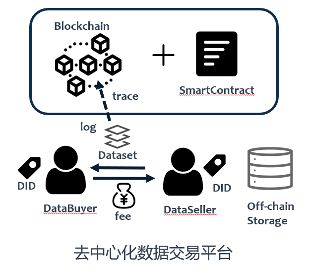
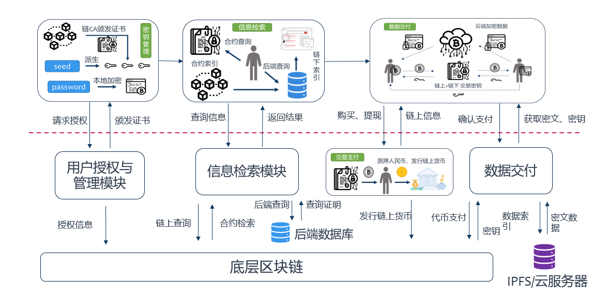
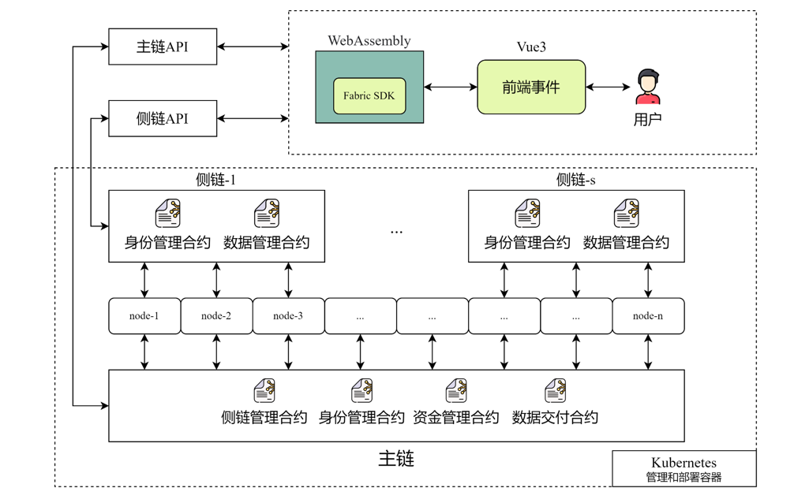
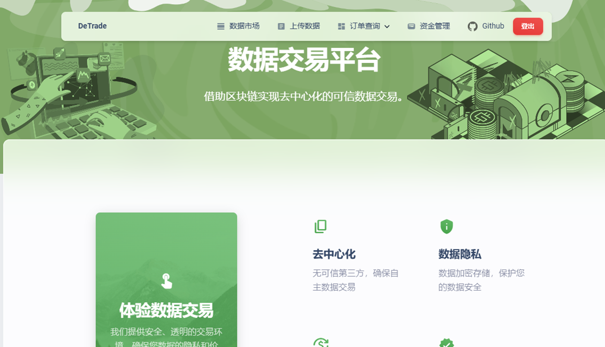

# DeTrade-大数据交易平台概要设计文档

## 第一章 平台概述

### 1.1 背景介绍

#### 1.1.1 数据交易市场

**数字经济已经成为国民经济的重要引擎，数据的交易流通有助于赋能实体经济，释放数据价值**。随着信息技术的发展，我国数字化转型不断深入，自党的十八大以来，党中央高度重视发展数字经济，并将其上升至国家战略。据中国信息通讯研究院发布的《中国数字经济发展研究报告》[1]显示，我国数字经济总体规模从2005年的2.62万亿元增长至2023年的53.9万亿元，数字经济总体规模占GDP比重也由2005年的14.2%提升至2023年的42.8%。可以看出，数字经济正在与实体经济进行深度融合，而数据作为数字经济下新型的生产要素，是数字化、网络化、智能化的基础[2]，已经逐渐演变为国家基础性战略资源，并日益对全球的生产、流通、分配、消费活动以及经济运行机制、社会生活方式等产生重要影响。在不同实体间，数据的交易流通能够有效进行资源整合，赋能实体经济，释放数据价值。

**大数据时代下，数据资源的价值逐步得到重视，数据交易需求也在不断增加**。大数据是以容量大、类型多、存取速度快、应用价值高为主要特征的数据集合，全球范围内，运用大数据推动经济发展、完善社会治理、提升政府服务和监管能力正成为趋势。人工智能等技术的出现也使得数据资源的价值得到进一步体现。目前，我国互联网、移动互联网用户规模居全球第一，拥有丰富的数据资源和应用市场优势，在数据交易市场上占有较大规模。2023全球数商大会上发布的《2023年中国数据交易市场研究分析报告》[3]指出，2022年，中国数据交易市场规模达876.8亿元(人民币)，在全球的占比为13.4%，在亚洲的占比为66.5%。我国的数据交易行业在近年进入了快速增长的发展阶段，并预计在未来仍能保持较高速的增长。

**规范大数据交易市场，建立健全数据资源交易机制势在必行**。在数据交易过程中，由于数据作为交易商品具有易复制性、难以追溯等特征，容易面临交易过程不规范、难以仲裁、隐私泄露等风险。2015年《促进大数据发展行动纲要》[4]明确指出要“引导培育大数据交易市场，开展面向应用的数据交易市场试点，探索开展大数据衍生产品交易，鼓励产业链各环节市场主体进行数据交换和交易，促进数据资源流通，建立健全数据资源交易机制和定价机制，规范交易行为。”基于此，结合有效技术手段设计和规范数据交易机制，实现数据流转全流程的公正可信，是当前数据交易行业亟待解决的挑战。

> [1].《中国数字经济发展研究报告》http://www.caict.ac.cn/kxyj/qwfb/bps/202408/P020240830315324580655.pdf
> [2].中共中央 国务院. 关于构建数据基础制度更
好发挥数据要素作用的意见[Z]. 2022.
The CPC Central Committee and the State
Council. Opinions on the construction of
data fundamental institutions for better
promoting the data factor value[Z]. 2022.
>
> [3]. https://www.chinanews.com.cn/cj/2023/11-26/10118324.shtml
>
> [4].  https://www.gov.cn/zhengce/content/2015-09/05/content_10137.htm

#### 1.1.2 中心化数据交易平台

传统的中心化数据交易平台依赖于可信第三方进行数据的上传、存储、交易等行为。数据售卖方和购买方需要分别通过平台进行数据的上传和下载，并且支付给平台额外的手续费用。

这种中心化架构除了会面临可能的单点故障问题外，还存在着许多其他问题：

**数据检索易被操纵而检索结果不全或被伪造**：由于数据检索结果是由中心化平台提供的，数据购买者无法确认数据检索结果的可靠性。数据交易平台可能会根据不同数据提供者所提交的“广告费”进行检索结果的优先排序，数据购买者可能无法快速检索到实际需要的数据。此外，数据售卖者可能会恶意提交不符合实际内容的标题或者检索关键字，或者和数据交易平台恶意共谋，从而使数据购买者检索并购买不符合要求的数据。

**交易流程不规范，出现纠纷难以存证进行仲裁**：数据商品相较于普通商品而言具有特殊性。一方面数据购买者可以抵赖已经收到的数据，或者恶意声称数据不符合期望，从而拒绝支付费用；另一方面，数据购买者确实需要获得数据后检查其是否符合期望质量，此时数据购买者已经获得了数据的副本，即使发现数据质量不符合期望，也可能因为数据售卖者的拒绝，无法和普通商品一样进行正常的售后退回流程。所以数据商品按照传统商品的售卖流程进行售卖将不再规范合理，此外，需要有合适的存证途径进行纠纷的仲裁。

**身份隐私、用户个人偏好等信息易泄露，访问控制等权限易篡改**：中心化的数据交易平台会获取用户检索和下载数据的所有信息，进而可以推测用户的个人偏好，甚至是身份隐私内容。此外，数据售卖者针对数据集的访问控制权限设置可能会被平台篡改，例如数据售卖者希望数据仅仅售卖给本校人员，但是平台为了更多的利益将数据售卖给了其他人，并且因为数据商品的特性，数据售卖者并不会察觉平台的行为。

#### 1.1.3 去中心化数据交易平台

面对以上痛点，本平台考虑引入区块链，利用区块链去中心化、不可篡改等特性，并结合智能合约的逻辑透明、自动执行特点，构建去中心化的数据交易平台。

**数据检索信息的公开不可篡改**：基于区块链的数据交易平台会将数据检索信息透明公开的保存在区块链上，所有人都可以自主查询相应的检索信息，从而保证检索结果的可信和不可篡改。数据购买方也可以直接通过检索信息和数据售卖方取得联系并进行数据交易，不需要第三方的中介信息或者额外的手续费用。

**交易流程关键步骤上链，实现可追溯、可仲裁**：借助区块链规范数据交易流程，通过将关键步骤上链的方式，对数据交易过程进行存证，每一笔数据交易都可以在区块链上进行追溯，并通过区块链提供的存证信息进行仲裁。进一步设计数据质量评估方案，从而实现数据交易全流程的可信、透明、公正。

**基于自我主权的去中心化身份DID实现匿名和不可链接**：自我主权的去中心化身份DID可以使用户掌握自己的身份信息，在去中心化交易平台上使用DID可以实现匿名性，进一步设计DID生成方案从而实现不可链接特性。

### 1.2 相关工作

#### 1.2.1 区块链技术概述

区块链最初由Nakamoto于2008年提出,其本质上是一个可靠的分布式账本。作为分布式系统，区块链在分布式网络上运行，通过共识机制实现节点间数据的一致性；作为数据账本，它将交易记录保存在通过哈希值链接的按照时间顺序排列的链式区块结构中，并利用非对称加密、哈希等密码算法和默克尔树（Merkle Hash Tree，MHT）等验证结构，实现数据的不可篡改存储和高效验证。区块链能够在不完全可信的环境中实现实体之间的信任关系，具有去中心化、防篡改、公开透明等性质。

根据实体的参与方案，区块链可以分为三类：

- 公有链：无官方组织及管理机构，无中心服务器，参与的节点按照系统规则自由接入网络，节点间基于共识机制开展工作。这种情况下，网络中的所有节点都可以读取和发送交易，参与共识，所有交易透明，参与者使用匿名或者伪匿名。
- 私有链： 建立在某个组织内部，系统的运作规则根据组织要求设定，修改甚至是读取权限仅限于少数节点，同时仍保留着区块链的真实性和部分去中心化特征，其主要作用是借助区块链的链式结构保障数据存储的可靠性，防止个人做出恶意删除等行为。
- 联盟链：权限控制介于公有链和私有链之间，由若干机构联合发起，共同管理区块链，具有更高的自主权和控制权。其典型应用包括Hyperlegder Fabric等。

此外， 随着区块链基础设施的发展，“智能合约”的概念被提出以面向更加复杂和灵活的场景。简单来说，智能合约是一组可以自动触发并忠实执行的计算机程序代码和相关数据，它将区块链技术的应用范围从基于货币交易的简单应用，延伸到了图灵完备的通用计算领域，从而允许设计更加复杂的计算逻辑以满足用户的需求。

#### 1.2.2 DID技术概述

去中心化身份DID架构是W3C于2019年8月首次提出的一种分布式数字身份管理架构。在该架构中，身份是完全去中心化的，DID可以用来表示人、组织、数据模型等实体的身份信息。

如图所示，参与DID技术的实体主要包括DID持有人（DID subject）、DID控制者（DID controller）和可验证的数据注册中心（Verifiable Data Registry）。其中，DID持有者是指拥有DID身份的实体，DID控制者是拥有DID标识符控制权的实体，而可验证的注册中心指的是提供DID标识符的生成、注册和颁发等服务的组织机构，负责管理和验证DID标识符的唯一和真实性。

实体所控制的身份信息主要有DID标识符、DID文档和DID URL。DID标识符也是统一资源标识符的一种，是由一组字符串组成的唯一标识符。DID文档通常是一个JSON文档，用于描述DID的元数据和验证信息等。DID URL是基于DID标识符的统一资源定位器，用于解析或者反引用到具体的DID文档。

面对不同的场景需求中，实现方也会使用不同的DID方法（DID method）。DID方法指的是实现DID技术的具体方法和协议，定义了DID创建，解析，删除和修改的方式等。DID方法的自主定义模式也极大增加了DID的可扩展性，能够面对具体的需求和应用场景，设计实现更加灵活、安全、高效的身份管理方案。

DID架构在实际应用中，通常会与VC技术结合使用。VC技术是一种通过加密安全和机器可验证方式表达凭证数据的机制，其核心在于可验证性，可以通过区块链、数字签名等技术手段，确保证书的真实性和可靠性。

如图所示，在VC技术中，通常涉及三类不同的实体，分别是发行者（Issuer）、使用者（Holder）和验证者（Verifier）。其中发行者是指颁发VC的实体，类似于传统PKI体系中的CA，例如企业、政府等。使用者是使用VC的实体，而验证者是验证VC的真实性和有效性的实体，通常是需要对VC进行验证的第三方服务提供商等。

通过对使用者签发VC可以证明其拥有某些属性。而使用者可以将多个VC进行组合或者处理，构成VP（Verifiable Presentation）进行进一步的验证。VP被验证方验证后可以确认持有者的身份和能力，并授予相关数据和服务，这一过程可以由持有者控制个人信息的披露范围。

DID架构的最大优势是将身份信息和属性信息进行分离，从而提供了极大的灵活性，同时用户能够绝对自主的掌握自己的身份，将身份标识和任何中央机构或第三方机构解耦，实现自主身份控制，其选择性披露机制也提供了一定的隐私保护能力。目前的很多区块链相关的主流社区和机构都实现了DID的部署应用，并提出了相关的DID方法，例如微软的ccf，比特币的btcr等。

#### 1.2.3 基于区块链的数据交易

### 1.3 设计目标

#### 1.3.1 大规模交易下的性能提升

在当前大规模数据交易的需求场景下，传统区块链由于其吞吐量受限的特点，在数据交易过程中的性能可能会受到限制，基于此，平台的设计目标之一是研究在大规模交易下的区块链性能提升，具体而言，我们通过设计了主侧链并行的网络架构，大幅提高了网络的吞吐量。

#### 1.3.2 隐私保护下的数据质量评估

针对数据商品难以进行质量评估即售后退款的问题，本平台设计了规范合理的渐进式数据交易流程。

#### 1.3.3 大数据安全交易和可信仲裁

结合区块链存证进行可信仲裁。结合DID实现匿名安全交易。

### 1.4 应用前景

据2022年的相关数据指出，金融行业是目前最大的细分业数据交易市场，占比达35%；其次是互联网行业，占比约为24%。目前，我国各地正加强“数据驱动力”，繁荣数据生态。

## 第二章 技术原理与设计

### 2.1 系统架构设计

### 2.2 信息检索模块

针对传统平台存在的数据检索不全，检索信息不透明等问题，提出三种检索方式

| **检索方式** | **说明**                                                     | **适用场景**                                                 |
| ------------ | ------------------------------------------------------------ | ------------------------------------------------------------ |
| 合约检索     | 用户通过合约提供的简单查询接口                               | 检索条件简单的场景                                           |
| 本地检索     | 用户通过合约检索相关数据描述信息，同时检索大量冗余信息，随后本地执行检索获得结果 | 适用与用户**隐私要求较高**，不愿暴露数据偏好，用户主机性能和带宽较强等场景 |
| 外包检索     | 用户向联盟链节点发送检索请求。联盟链节点基于链上信息和其本地维护的数据库给出检索结果和正确性证明 | 用户对隐私要求不高，本地主机性能弱                           |

### 2.3 用户授权和管理模块

针对传统中心化身份管理系统中存在的身份隐私易泄露，权限管理不公开等问题，提出以下内容：

1. 可审查的不可链接性DID用户向权威机构提交个人身份凭证等，获取根DID根DID不能直接使用，只能通过与所要加入的组织的联盟CA合作生成子DID，根DID此时仅提供合法身份证明和查重
2. 细粒度管理用户权限，CA负责向系统合约写入用户对部分合约的读权限具体合约的接口权限由合约管理者单独配置

### 2.4 交易交付模块

渐进式交易过程：在去中心化交易场景下，为了保证数据的可用性和不可抵赖性，设计了多子集的数据交付过程，具体交易流程如下：

1. 将数据集切分成多个子集，并且生成对应的密钥进行加密，存储在云中

   $D\xrightarrow{Devide}\{D_1,...,D_n\}$

   $CD_i =Enc (K_i,D_i)$

2. 数据请求者通过智能合约生成子集的交易序列，并在智能合约中存入对应预先支付的资金，对随机数x生成哈希链，上传最后一个哈希值

   $\{H^1(x),...,H^{n+1}(x)\}$

3. 通过链下通道逐子集交付数据，在链上提交最终状态，并关闭通道。数据请求者每确认一个子集数据Di，向数据拥有者提供一个payword：

   $p_i =H^{n+1-i}(x)$

4. 通道关闭

   - 拥有payword：合约验证后发送对应奖励
   - 未拥有payword ：将请求者的确认签名$\sigma _i$ 以及$k_i^2$上传并验证tag

5. 验证与仲裁

   $Verify(pk_{requester},\sigma _{s_i},H(k^1_{S_i})) == 1$

   $t= H(k^1_{S_i}))\oplus H(k^2_{S_i}))$

### 2.5 主侧链并行架构

网络架构设计如下：

## 第三章 系统搭建与实现

### 3.1 智能合约设计

本部分将简要介绍智能合约实现模块以及接口：

#### 数据结构

### 3.2 Fabric区块链

本平台基于Fabric区块链进行搭建。

### 3.3 服务器端设计

### 3.4 前端UI设计

## 第四章 平台展示与实验测试

### 4.1 DeTrade功能实现展示

#### 4.1.1 平台主要页面概览

首页：

用户登录：

数据集查询：

上传数据：

cash 系统：

订单管理：

密钥交付：

资金结算：

#### 4.1.2 数据检索

#### 4.1.3 用户身份管理

#### 4.1.1 数据交易流程

### 4.2 性能测试

## 第五章 总结